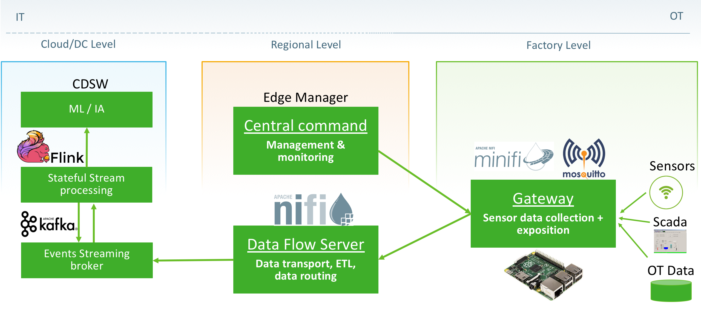

= Event Streaming Architecture for Industry 4.0 using Apache NiFi, MiNiFi, Kafka and Flink

This demo shows how the Cloudera Data Flow platform can be used to build an end-to-end Industrial IOT architecture for real-time data collection and processing.
It's based on a previous blog I published for FreeCodeCamp some time ago and the excellent implementation/automation scripts from https://github.com/fabiog1901[Fabio]:

. Blog: https://medium.com/free-code-camp/building-an-iiot-system-using-apache-nifi-mqtt-and-raspberry-pi-ce1d6ed565bc
. Implementation: https://github.com/fabiog1901/IoT-predictive-maintenance
. Automation script: https://github.com/fabiog1901/OneNodeCDHCluster

== Use case
New use cases under the Industry 4.0 umbrella are playing a key role in improving factory operations, process optimization, cost reduction and quality improvement. This project implement an event streaming architecture to streamline the information flow all the way from the factory to the main data center.  Building such a streaming architecture enables a manufacturer to react faster to critical operational events. However, it presents two main challenges:

. Data acquisition in real time: data should be collected regardless of its location or access challenges are. It is commonplace to ingest data from hundreds of heterogeneous data sources (ERP, MES, Sensors, maintenance systems, etc).
. Event processing in real time: events collected from different parts of the organization should be combined into actionable insights in real time. This is extremely challenging in a context where events can be lost or delayed.

This demo shows how Apache NiFi and MiNiFi can be used to collect a wide range of data sources in real-time, connecting the industrial and information worlds. Then, it shows how Apache Flink’s unique features enables us to make sense of this data. For instance, it shows how Flink’s time management such Event Time mode, late arrival handling and watermark mechanism can be used to address the challenge of processing IoT data originating from geographically distributed plants.

The high level architecture is explained in the following schema.

== Installation

This script automatically sets up a CDH cluster on the public cloud on a single VM with the following 17 services:

[%autowidth,cols="1a,1a,1a,1a,1a",options="header"]
|====
^|CEM ^|CFM ^|CSP ^|CDH ^|CDSW
|* MiNiFi
* EFM
|* NiFi
* NiFi Registry
* NiFi CA Service
|* Kafka
* Flink
* Schema Registry
* Streams Messaging Manager
|* ZooKeeper
* HDFS
* YARN
* Spark
* Hive
* Impala
* Kudu
* Hue
* Oozie
|* CDSW
|====

As this cluster is meant to be used for demos, experimenting, training, and workshops, it doesn't setup Kerberos and TLS.

== Setup instructions

. Provision one VM for the cluster setup

* Create a Centos 7 VM with at least 16 vCPUs/ 64 GB RAM (ex. m5a.4xlarge). Choose the plain vanilla Centos image, not a cloudera-centos image.
+
NOTE: This is a vanilla Centos 7 AMI. No other prerequistes are necessary. All the required software will be installed by the setup process.
* OS disk size: at least *100 GB*.
* Docker device disk: at least *200 GB* SSD disk.
+
NOTE: You need a fast disk for the *Docker volume*. Aim for a disk with 3000 IOPS. This might mean choosing a 1TB disk.
+
IMPORTANT: Ensure that you allocate disks with the sizes specified above, or larger. Otherwise, you may run out of space during the workshop.

. Configure VM and networking

* If you created the VM on Azure and need to resize the OS disk, here are the [instructions](scripts/how-to-resize-os-disk.md).
* Add 2 inbound rules to the Security Group:
** to allow your IP only, for all ports.
** to allow the VM's own IP, for all ports.

. SSH into the VM, clone this repository and `cd` to the scripts directory:
+
[source,shell]
----
# Install YUM, skip if you already have it
sudo yum install -y git

# Clone the repo
git clone https://github.com/ahadjidj/connected-plants.git

# Go to the scripts directory
cd connected-plants/setup
----

. Review software versions and edit them as needed. All the versions and locations of the software used for the setup are defined in the `connected-plants/setup/env.sh` file. If this file does not exist, create it with the command below:
+
[source,shell]
----
cp env.sh.template env.sh
----
+
IMPORTANT: Most of the software locations are already pre-defined in the template. For a few of the required software, though, there's currently no public repository available. Make sure you follow the instructions below to install these components.
+
For Schema Registry (SR) and Streams Messaging Manager (SMM) installation you have two options:

* If If you have an URL link to a location where the CSP parcel and SR/SMM CSDs can be downloaded from, configure the corresponding properties in the `env.sh` file:
+
[source,shell]
----
SCHEMAREGISTRY_VERSION=
STREAMS_MESSAGING_MANAGER_VERSION=
CSP_PARCEL_REPO=
SCHEMAREGISTRY_CSD_URL=
STREAMS_MESSAGING_MANAGER_CSD_URL=
----
+
NOTE: The version of the components, as indicated in the `SCHEMAREGISTRY_VERSION` and `STREAMS_MESSAGING_MANAGER_VERSION` variables, have the form: `<csd_version>.<parcel_version>`. For example, for the CSD binary `SCHEMAREGISTRY-0.8.0.jar` and parcel version `2.0.0.0-112` the Schema Registry version is `0.8.0.2.0.0.0-112`.

* Alternatively, leave the properties above unset and download the CSP parcel into `connected-plants/setup/parcels/` and both CSDs into `connected-plants/setup/csds/`. Note that the setup process will upload these files to every VM it creates, so if you're launching a large nuber of VMs, expect a good amount of upload volume.

. Run the `setup.sh` script. It takes 3 arguments:
+
IMPORTANT: The script current implementation only supports AWS deployments. Azure and GCP will be added in the future.

** The cloud provider name: `aws`,`azure`,`gcp`.
** The template file.
** (OPTIONAL) the Docker Device disk mount point.

+
--
_Example_:

[source,shell]
----
chmod +x setup.sh
sudo ./setup.sh aws cdsw_template.json /dev/nvme1n1
----
--

. Wait until the script finishes, check for any error.

== Use

* Once the script returns, you can open Cloudera Manager at http://<public_dns>:7180. The default credentials are `admin/admin`.

* Wait for about 10-20 mins for CDSW to be ready. You can monitor the status of CDSW by issuing the `cdsw status` command.

* You can use `kubectl get pods -n kube-system` to check if all the pods that the role `Master` is suppose to start have really started.

* You can also check the CDSW deployment status on `CM > CDSW service > Instances > Master role > Processes > stdout`.

== Troubleshooting and known issues

=== Clock Offset

The NTPD service which is required by Kudu and the Host is not installed. For the moment, just put
`--use-hybrid-clock=false`  in Kudu's Configuration property `Kudu Service Advanced Configuration Snippet (Safety Valve) for gflagfile` and suppressed all other warnings.

=== Docker device

To find out what the docker device mount point is, use `lsblk`. See below examples:

See examples below:

==== AWS, using a M5.2xlarge or M5.4xlarge VM:

[source,shell]
----
$ lsblk
NAME        MAJ:MIN RM  SIZE RO TYPE MOUNTPOINT
nvme0n1     259:1    0  100G  0 disk
+-nvme0n1p1 259:2    0  100G  0 part /
nvme1n1     259:0    0 1000G  0 disk

$ sudo ./setup.sh aws cdsw_template.json /dev/nvme1n1
----

==== Azure Standard D8s v3 or Standard D16s v3

[source,shell]
----
$ lsblk
NAME   MAJ:MIN RM  SIZE RO TYPE MOUNTPOINT
fd0      2:0    1    4K  0 disk
sda      8:0    0   30G  0 disk
+-sda1   8:1    0  500M  0 part /boot
+-sda2   8:2    0 29.5G  0 part /
sdb      8:16   0   56G  0 disk
+-sdb1   8:17   0   56G  0 part /mnt/resource
sdc      8:32   0 1000G  0 disk
sr0     11:0    1  628K  0 rom

$ sudo ./setup.sh azure cdsw_template.json /dev/sdc
----

==== GCP n1-standard-8 or n1-standard-16

[source,shell]
----
$ lsblk
NAME   MAJ:MIN RM  SIZE RO TYPE MOUNTPOINT
sda      8:0    0  100G  0 disk 
└─sda1   8:1    0  100G  0 part /
sdb      8:16   0 1000G  0 disk 

$ sudo ./setup.sh gcp cdsw_template.json /dev/sdb
----

